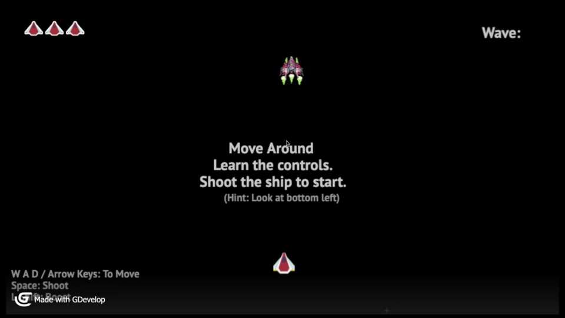

# Star RainStorm: The Game


 Welcome to **Star RainStorm: The Game**, a thrilling retro space shooter that takes you on an unforgettable journey through the galaxy. As the pilot of a lone spaceship, you're tasked with defending the universe from an onslaught of alien forces. With classic arcade gameplay, modern twists, and endless fun, this game promises to bring hours of entertainment and challenge to players of all ages.


## Features

- **Classic Arcade Gameplay**: Experience the nostalgia of retro space shooters combined with modern gameplay elements.
- **Infinite Space Environment**: Navigate through an ever-changing space environment where the challenge continuously grows.
- **Touchscreen Support**: Optimized for both desktop and mobile devices, including touchscreen controls for a seamless gaming experience.

    #### (Coming Soon Features)
- **Ship Customization**: Upgrade your spaceship's weaponry and abilities to suit your playstyle.
- **Diverse Enemy Types**: Battle against a variety of alien enemies, each with unique attack patterns and challenges.
- **Power-Ups**: Collect power-ups during your journey for temporary boosts in firepower and defense.

## Getting Started

1. To dive into the action, simply clone this repository and open `index.html` in your favorite web browser.

```sh
    git clone https://github.com/Rahul-Sahani04/Star-Rainstorm.git
```

```sh
    cd Star-Rainstorm
```
2. Open index.html in browser to play the game. 

3. Enjoy the game and share your high scores with us!

## Gameplay Screenshots


## Demo Video

[](ScreenShots/DemoVideo.mp4)

## Built With

- [GDevelop](https://gdevelop.io) - An open-source game creation software, allowing to make games for the web without programming.
- HTML5 & JavaScript - For a responsive and interactive gaming experience.

## Contributing

We welcome contributions to **Star RainStorm: The Game**! If you have suggestions or bug reports, please feel free to open an issue or submit a pull request.

## License

This project is licensed under the MIT License - see the LICENSE file for details.

## Acknowledgments

- Special thanks to the GDevelop community for their support and resources.
- All game assets and music are credited to their respective creators.

Embark on your space adventure in **Star RainStorm: The Game** and become the hero the galaxy needs!
